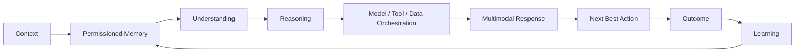

<div align="center">

# 🧠 LifeOS AI

### Human Intelligence & Care Operating System

**ASK LifeOS** — a personal AI operating layer designed to understand context, organize life, support health & care, and turn intent into meaningful action.

[](https://github.com/AddiX123/LifeOS-AI)
[](https://github.com/AddiX123/LifeOS-AI)
[](https://react.dev/)
[](https://vite.dev/)
[](https://www.typescriptlang.org/)

</div>

---

## 🌌 What is LifeOS AI?

LifeOS AI is being built as a **Human Intelligence & Care Operating System** — not just another chatbot.

The core idea is simple:

> **Understand the person → reason about the situation → coordinate intelligence and tools → recommend the next best action → learn from outcomes.**

LifeOS brings conversation, goals, daily planning, research, personal knowledge, health & care, privacy, and AI-powered creation into one product experience.

### Product vision

**Context + Permissioned Memory + Goals + Constraints + Preferences + Conversational Context**

→ **Understanding**

→ **Reasoning**

→ **Model / Tool / Data Orchestration**

→ **Multimodal Response**

→ **Next Best Action**

→ **Outcome**

→ **Learning**

---

## 🧭 Explore LifeOS

| Module | Purpose |
|---|---|
| 🧠 **ASK LifeOS** | Natural-language AI workspace for questions, decisions, planning and action |
| 🎯 **Life Goals / Day Mastery** | Turn goals into plans and build consistent daily execution |
| ❤️ **Health & Care** | Health-focused intelligence and care workflows — the flagship vertical |
| 🔬 **Research** | Research-oriented knowledge and information workflows |
| 📚 **Library** | Personal files and knowledge workspace |
| 🔐 **Privacy** | User-facing privacy and data-control experience |
| ⚙️ **Settings** | Product, account and experience configuration |
| 🎨 **AI Creation** | Image generation and creative workflows |
| 🎬 **Video** | VEED/FAL-powered video generation workflow |
| 💳 **Billing** | Razorpay-powered subscription and payment infrastructure |

---

## 🧬 LifeOS Intelligence Architecture



### The operating loop

1. **Context** — understand what is happening now.
2. **Memory** — use only the information the user permits LifeOS to retain and use.
3. **Understanding** — interpret intent, constraints, preferences and conversational context.
4. **Reasoning** — evaluate options, trade-offs and priorities.
5. **Orchestration** — select the appropriate model, tool, data or workflow.
6. **Response** — return the result in the most useful modality.
7. **Next Best Action** — move from information toward execution.
8. **Outcome** — observe what happened.
9. **Learning** — improve future assistance from permitted feedback and outcomes.

---

## ❤️ Health & Care — Flagship Vertical

LifeOS is designed to grow beyond general productivity into a **Health & Care operating layer**.

The long-term product direction includes:

- Personal health context
- Care coordination
- Health information understanding
- Medication and appointment organization
- Care-circle workflows
- Preventive and habit-oriented support
- Health research assistance
- Context-aware next-best actions
- Privacy-first handling of sensitive information

> **LifeOS is intended to assist people and care workflows — not replace qualified medical professionals or emergency services.**

---

## 🤖 Intelligence Layers

LifeOS is designed around an orchestration model rather than dependence on one model.

| Intelligence layer | Role |
|---|---|
| 🧠 Reasoning | Analyze situations, decisions and trade-offs |
| 🗂️ Memory | Maintain permissioned context across interactions |
| 🎯 Planning | Convert goals and intent into executable steps |
| 🔎 Research | Gather and organize relevant knowledge |
| 🛠️ Tool orchestration | Connect AI reasoning with external capabilities |
| 👁️ Multimodal | Support text, files, images and future voice workflows |
| ❤️ Care intelligence | Apply context-aware assistance to Health & Care |
| 🔁 Learning loop | Improve assistance through permitted outcomes and feedback |
| 🛡️ Safety | Keep human control, privacy and appropriate boundaries central |

---

## 📊 Capability Map

| Capability | LifeOS AI direction |
|---|---|
| Personal AI | ✅ Core |
| Conversational interface | ✅ Core |
| Goal management | ✅ Core |
| Daily planning | ✅ Core |
| Permissioned memory | 🚧 Expanding |
| Research workflows | ✅ Core |
| Personal library | ✅ Core |
| Health & Care | ❤️ Flagship |
| Multimodal interaction | 🚧 Expanding |
| Image generation | ✅ Integrated workflow |
| Video generation | ✅ Integrated workflow |
| Payments / subscriptions | ✅ Integrated workflow |
| Agentic orchestration | 🚧 Roadmap |
| Continuous learning | 🚧 Roadmap |

---

## 🌍 Where LifeOS Can Help

LifeOS is being designed as a broad operating layer with **Health & Care as the flagship vertical**.

- ❤️ Health & Care
- 🎓 Education & learning
- 🎯 Personal goals & productivity
- 💼 Career & professional development
- 🔬 Research & knowledge work
- 💰 Personal finance organization
- 👨‍👩‍👧 Family & Care Circle
- ✈️ Travel & planning
- 🧑‍💻 Software & technology workflows
- 🎨 Creative work
- 🏢 Business workflows

The product should adapt its intelligence to the user's context instead of forcing every problem into the same chatbot interaction.

---

## ⚡ Quick Start

### Requirements

- Node.js 18+
- npm
- Required provider credentials for the features you enable

### Install

```bash
git clone https://github.com/AddiX123/LifeOS-AI.git
cd LifeOS-AI
npm install
```

### Environment

Configure secrets in your deployment environment. **Never commit API keys to GitHub.**

```env
OPENAI_API_KEY=your_key_here
RAZORPAY_KEY_ID=your_key_here
RAZORPAY_KEY_SECRET=your_key_here
FAL_KEY=your_key_here
```

Only add credentials required by the corresponding feature and deployment configuration.

### Development

```bash
npm run dev
```

### Production build

```bash
npm run build
npm run preview
```

---

## 🏗️ Technology Foundation

LifeOS AI currently uses a lightweight modern web stack:

| Layer | Technology |
|---|---|
| UI | React 19 |
| Language | TypeScript 5.7 |
| Build | Vite 6 |
| Styling | Tailwind CSS |
| Icons | Lucide React |
| AI / App integration | AppDeploy SDK / client |
| AI media | FAL client |
| Documents | PDF.js + Mammoth |
| Payments | Razorpay integration |

The repository is intentionally kept free of secret values.

---

## 📁 Repository

```text
LifeOS-AI/
├── README.md
├── index.html
├── package.json
└── src/
    └── application source
```

The application source is organized around LifeOS's product modules, while this README serves as the high-level product, architecture and developer entry point.

---

## 🔐 Security Principles

LifeOS is designed with privacy and user control as first-class concerns.

- 🔑 Never commit API keys or credentials.
- 🧠 Memory should be permissioned and user-controlled.
- 🔒 Sensitive Health & Care information requires stronger privacy boundaries.
- 👤 Human control remains central to consequential decisions.
- 🧯 AI output should be treated as assistance, not automatic authority.

---

## 🗺️ Roadmap

### V1 — Foundation

- [x] ASK LifeOS experience
- [x] Life Goals / Day Mastery foundation
- [x] Research
- [x] Library
- [x] Privacy
- [x] Settings
- [x] AI image generation workflow
- [x] Video generation workflow
- [x] Razorpay billing foundation
- [x] GitHub project documentation

### V2 — Personal Intelligence

- [ ] Stronger permissioned memory
- [ ] Deeper personalization
- [ ] Better goal-to-action planning
- [ ] Improved multimodal interaction
- [ ] More intelligent next-best-action workflows

### V2.x — LifeOS Intelligence

- [ ] Agent orchestration
- [ ] Specialized intelligence modules
- [ ] Advanced research workflows
- [ ] Outcome-based learning loops
- [ ] Expanded Health & Care capabilities

### Future

- [ ] Cross-platform LifeOS experience
- [ ] Care Circle ecosystem
- [ ] Larger intelligence/tool ecosystem
- [ ] Advanced health integrations
- [ ] Broader industry operating layers

---

## 🧠 The LifeOS Principle

LifeOS should not simply answer:

> **“What did you ask?”**

It should progressively understand:

> **“What are you trying to accomplish, what matters to you, what constraints exist, what happened before, and what is the best next step?”**

That is the foundation of the **Human Intelligence & Care Operating System**.

---

## 👨‍💻 Project

**LifeOS AI** is an evolving product and research project focused on building a more contextual, personalized and action-oriented AI experience.

⭐ Star the repository if you want to follow the evolution of LifeOS AI.

[GitHub Repository](https://github.com/AddiX123/LifeOS-AI)

---

<div align="center">

### 🧠 LifeOS AI
**Understand. Reason. Act. Learn.**

</div>
