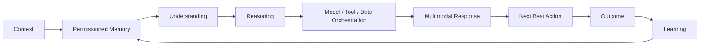

<div align="center">

# 🧠 LifeOS AI

### Human Intelligence & Care Operating System

**ASK LifeOS** — a personal AI operating layer designed to understand context, organize life, support health & care, and turn intent into meaningful action.

[](https://github.com/AddiX123/LifeOS-AI)
[](https://github.com/AddiX123/LifeOS-AI)
[](https://react.dev/)
[](https://vite.dev/)
[](https://www.typescriptlang.org/)

</div>

---

## 🌌 What is LifeOS AI?

LifeOS AI is being built as a **Human Intelligence & Care Operating System** — not just another chatbot.

> **Understand the person → reason about the situation → coordinate intelligence and tools → recommend the next best action → learn from outcomes.**

LifeOS brings conversation, goals, daily planning, research, personal knowledge, health & care, privacy, and AI-powered creation into one product experience.

## 🧭 Explore LifeOS

| Module | Purpose |
|---|---|
| 🧠 **ASK LifeOS** | Natural-language AI workspace for questions, decisions, planning and action |
| 🎯 **Life Goals / Day Mastery** | Turn goals into plans and build consistent daily execution |
| ❤️ **Health & Care** | Health-focused intelligence and care workflows — the flagship vertical |
| 🔬 **Research** | Research-oriented knowledge and information workflows |
| 📚 **Library** | Personal files and knowledge workspace |
| 🤖 **Agents** | Specialized, permissioned task agents with review/approval gates |
| 🔐 **Privacy** | User-facing privacy and data-control experience |
| ⚙️ **Settings** | Product, account and experience configuration |
| 🎨 **AI Creation** | Image generation and creative workflows |
| 🎬 **Video** | Video generation workflow |
| 💳 **Billing** | Subscription and payment infrastructure |

## 🧬 LifeOS Intelligence Architecture



### The operating loop

**Context → Memory → Understanding → Reasoning → Orchestration → Response → Next Best Action → Outcome → Learning**

## ❤️ Health & Care — Flagship Vertical

LifeOS is designed to grow beyond general productivity into a **Health & Care operating layer**.

- Personal health context
- Care coordination
- Health information understanding
- Medication and appointment organization
- Care-circle workflows
- Preventive and habit-oriented support
- Health research assistance
- Context-aware next-best actions
- Privacy-first handling of sensitive information

> **LifeOS assists people and care workflows — it does not replace qualified medical professionals or emergency services.**

## 🤖 Intelligence Layers

| Intelligence layer | Role |
|---|---|
| 🧠 Reasoning | Analyze situations, decisions and trade-offs |
| 🗂️ Memory | Maintain permissioned context across interactions |
| 🎯 Planning | Convert goals and intent into executable steps |
| 🔎 Research | Gather and organize relevant knowledge |
| 🛠️ Tool orchestration | Connect AI reasoning with external capabilities |
| 👁️ Multimodal | Support text, files, images and future voice workflows |
| ❤️ Care intelligence | Apply context-aware assistance to Health & Care |
| 🔁 Learning loop | Improve assistance through permitted outcomes and feedback |
| 🛡️ Safety | Keep human control, privacy and appropriate boundaries central |

## 📊 Framework Comparison

LifeOS is **framework-agnostic by design**. A framework should be selected for a specific workload rather than forcing the entire product into one abstraction.

| Framework / approach | Strong fit | LifeOS role | Key trade-off |
|---|---|---|---|
| **LangGraph** | Stateful, durable, graph-based agent workflows | ⭐ Complex orchestration candidate | More explicit architecture and operational complexity |
| **OpenAI Agents SDK** | Focused agents, tools, handoffs and guardrails | ⭐ Specialist-agent candidate | Ecosystem dependence |
| **CrewAI** | Role-based multi-agent teams | 🧪 Research/prototyping option | Abstraction/control trade-off |
| **Microsoft Agent Framework** | Microsoft/Azure-oriented workflows | 🔭 Enterprise research | Ecosystem-dependent |
| **Google ADK** | Google/Gemini-oriented agents | 🔭 Gemini research | Ecosystem-dependent |
| **LlamaIndex** | RAG, documents and knowledge workflows | ⭐ Library/Research candidate | More data-centric than OS-wide |
| **Direct model/tool loop** | Small controlled workflows | ✅ Use when a framework adds no value | More engineering responsibility |

## 🔧 Browse by Framework

### LangGraph
Stateful workflows, durable execution, checkpoints and human-in-the-loop systems.

**LifeOS:** Memory orchestration · Goal planning · Deep Research · Care coordination · Approval-gated workflows

### OpenAI Agents SDK
Focused agents, tools, handoffs, guardrails and tracing.

**LifeOS:** ASK LifeOS specialists · Research Agent · Planning Agent · Library Agent · Safety Agent

### CrewAI
Role-based agent teams and rapid multi-agent experiments.

**LifeOS:** Researcher + Writer + Reviewer · Career planning · Business analysis

### Microsoft Agent Framework
Enterprise and Microsoft ecosystem workflows.

**LifeOS:** Enterprise Care Circle · Microsoft 365 productivity · Organization knowledge agents

### Google ADK
Google/Gemini-oriented agent applications.

**LifeOS:** Gemini multimodal workflows · Research agents · Workspace integrations

### LlamaIndex
Documents, retrieval, indexing and knowledge-intensive applications.

**LifeOS:** Personal Library RAG · Research knowledge base · Health-document understanding · Knowledge graph experiments

> These are architectural research categories. A framework is not considered part of the production stack until it earns its place through benchmarks and a real product requirement.

## 🏭 Industry Use Cases

| Industry | Example LifeOS capability | Priority |
|---|---|---|
| ❤️ Healthcare & Care | Health context, care coordination, information organization | ⭐ Flagship |
| 🎓 Education | Study planning, research and learning workflows | High |
| 💼 Career | Career planning, applications and interview preparation | High |
| 🏢 Business | Meetings, research, planning and workflow automation | High |
| 🔬 Research | Deep research, evidence synthesis and knowledge management | High |
| 💰 Finance | Personal organization, budgeting workflows and financial research | Medium |
| 👨‍👩‍👧 Family | Care Circle, shared goals and household planning | High |
| ✈️ Travel | Trip planning, documents, schedules and next actions | Medium |
| 🧑‍💻 Software | Coding research, project planning, documentation and agents | High |
| 🎨 Creative | Image, video, writing and content workflows | High |
| 📣 Marketing | Campaign planning, research, content and analytics | Medium |
| 🛍️ E-commerce | Product research, shopping assistance and operations | Medium |
| 🏠 Personal Life | Routines, goals, tasks, decisions and daily planning | ⭐ Core |

## 🤝 Contributing

Contributions are welcome! 🎉 LifeOS grows through ideas, research, documentation, integrations and carefully reviewed code.

### Ways to contribute

1. **Build a LifeOS capability** — add a focused module, agent, tool adapter or UI improvement.
2. **Add an integration** — propose a framework, model, data source or external tool with a clear use case.
3. **Add an industry use case** — document a realistic workflow and its safety/permission requirements.
4. **Improve research** — add primary sources, benchmarks, experiments or architecture findings.
5. **Fix a bug or broken link** — open an issue or submit a focused pull request.
6. **Improve documentation** — clarify setup, architecture, examples or limitations.
7. **Improve accessibility** — keyboard navigation, screen-reader support, contrast and multimodal usability.

### Contribution flow

```text
Fork → Branch → Focused change → Tests → Documentation → Pull Request → Review → Verify → Merge
```

Recommended branches: `feat/memory-engine` · `feat/research-agent` · `feat/health-care` · `feat/framework-adapter` · `fix/description` · `docs/research-topic`

**Never commit API keys, tokens or private health information.** Consequential external actions must have appropriate authorization and approval controls.

## ⭐ Star History

<p align="center">
  
</p>

> **Real-time chart:** A GitHub Action regenerates this chart from the repository's stargazer timeline every day. The chart shows verified repository stars; it does not use the illustrative 10K target graphic.

## 🔐 Security Principles

- Never commit API keys or credentials.
- Memory should be permissioned and user-controlled.
- Sensitive Health & Care information requires stronger privacy boundaries.
- Human control remains central to consequential decisions.
- AI output should be treated as assistance, not automatic authority.

## 🗺️ Roadmap

### V1 — Foundation

- [x] ASK LifeOS
- [x] Life Goals / Day Mastery
- [x] Research
- [x] Library
- [x] Privacy
- [x] Settings
- [x] AI creation workflows
- [x] Billing foundation
- [x] Framework comparison and browsing architecture
- [x] Industry use-case catalog
- [x] Contribution guide
- [x] Automated Star History

### V2 — Personal Intelligence

- [ ] Stronger permissioned memory
- [ ] Deeper personalization
- [ ] Better goal-to-action planning
- [ ] Improved multimodal interaction
- [ ] More intelligent next-best-action workflows

### V2.x — LifeOS Intelligence

- [ ] Agent orchestration
- [ ] Specialized intelligence modules
- [ ] Advanced research workflows
- [ ] Outcome-based learning loops
- [ ] Expanded Health & Care capabilities

### Future

- [ ] Cross-platform LifeOS experience
- [ ] Care Circle ecosystem
- [ ] Larger intelligence/tool ecosystem
- [ ] Advanced health integrations
- [ ] Broader industry operating layers

## 🧠 The LifeOS Principle

LifeOS should not simply answer **“What did you ask?”**

It should progressively understand:

> **“What are you trying to accomplish, what matters to you, what constraints exist, what happened before, and what is the best next step?”**

---

<div align="center">

### 🧠 LifeOS AI
**Understand. Reason. Act. Learn.**

</div>
