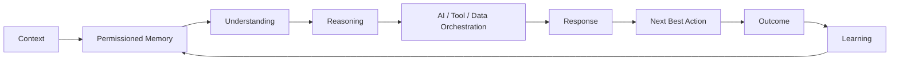

<div align="center">

# 🧠 LifeOS AI

### Human Intelligence & Care Operating System

**ASK LifeOS** — a context-aware personal AI workspace for organizing your day, goals, conversations, research, personal knowledge, and Health & Care workflows.

[](https://github.com/AddiX123/LifeOS-AI)
[](https://github.com/AddiX123/LifeOS-AI)
[](https://react.dev/)
[](https://vite.dev/)
[](https://www.typescriptlang.org/)

[**Open LifeOS AI →**](https://lifeos-ai-xhdmll.v2.appdeploy.ai/)

</div>

---

## 🌌 What is LifeOS AI?

LifeOS AI is a web application built around the idea of a **Human Intelligence & Care Operating System**.

The current product combines an AI conversation workspace with daily planning, Life Goals, Health & Care connectivity, research, a personal Library, privacy controls, and settings.

The central product direction is:

> **Context → Permissioned Memory → Understanding → Reasoning → AI / Tool Orchestration → Response → Next Best Action → Outcome → Learning**

The current application implements parts of this direction today, while deeper memory, agent orchestration and outcome-learning capabilities remain areas of development.

---

## 🧭 Explore LifeOS

The current web application provides these main surfaces:

| Module | What it currently does |
|---|---|
| 🏠 **Today** | LifeOS command center with Next Best Action, Memory status, Health & Care entry point, and shortcuts into the main workflows |
| 📅 **Day Plan** | Add daily goals/tasks, mark them complete, delete items, and view a 14-day consistency/mastery graph |
| 🧠 **Ask LifeOS** | Conversational AI workspace with LifeOS Vitalis V1 and GPT Base modes, chat history, attachments and multimodal processing |
| 🎯 **Life Goals** | Create, complete and delete Life Goals and ask LifeOS to turn a goal into a practical plan |
| ❤️ **Health & Care** | Secure pairing flow for iPhone/Apple Health or Android/Health Connect with explicit category permissions |
| 🔎 **Research** | Submit research questions and move them into an Ask LifeOS conversation |
| 📚 **Library** | Search saved chats/research history and access media-library functionality |
| 🔐 **Privacy** | Control Memory, view file/health-data permissions and review proactive-action boundaries |
| ⚙️ **Settings** | Plans, personalization, profile, billing, data control, storage, safety, security, trusted contact, account and keyboard settings |

---

## 🧠 Ask LifeOS

**Ask LifeOS** is the primary AI interaction surface.

Current capabilities in the web app include:

- 💬 Conversational AI
- 🧬 **LifeOS Vitalis V1** — health + care oriented intelligence mode
- 🤖 **GPT Base** mode
- 🧠 Optional Memory context
- 📎 Multiple file attachments
- 🖼️ Image input
- 🎧 Audio input
- 📄 PDF text extraction with visual fallback
- 📝 DOCX text extraction
- 📃 TXT / Markdown / CSV / JSON / XML processing
- 🎥 Video visual-frame sampling
- 💾 Saved chat history
- 🔎 Research-to-chat workflow

The application sends permitted conversation context and supported attachments to its AI backend through the app's `/api/ai/chat` endpoint.

### Memory

Memory is explicitly controlled in the application. When Memory is enabled, permitted past context can influence answers. When disabled, the interface describes the mode as **current input only**.

---

## 📅 Day Plan & Day Mastery

The Day Plan is designed around execution rather than long-term goal storage.

Current functionality:

- Add a goal, task, appointment or constraint
- Check off completed items
- Remove items
- Track today's completion percentage
- View planned versus completed items
- View a rolling **14-day consistency graph**
- Display current streak, daily consistency and planned-goal count

**Life Goals and Day Plan are intentionally separate concepts:** Life Goals represent longer-term direction; Day Plan represents today's execution.

---

## 🎯 Life Goals

Life Goals provide a separate space for longer-term objectives.

Current functionality:

- Create a Life Goal
- Add a description
- Mark goals completed
- Delete goals
- Track progress
- Ask LifeOS to convert a goal into milestones, weekly actions and a next-best action

---

## ❤️ Health & Care

Health & Care is the flagship vertical of the LifeOS product direction.

The current web application includes a **secure pairing workflow** rather than pretending that a normal browser can directly read phone health data.

### Supported connector targets

- 🍎 **iPhone · Apple Health / HealthKit**
- 🟢 **Android · Health Connect**

The current pairing flow can request permission for categories including:

- Steps
- Heart rate
- Sleep
- Workouts
- Weight
- Respiratory rate
- Active energy

The UI explicitly states that health data is only received after permissioned mobile synchronization. Users can also disconnect an existing health connection.

> **LifeOS is an assistance and organization system. It does not replace qualified medical professionals or emergency services.**

---

## 🔎 Research

The Research surface is built for questions about subjects such as health, diseases, science, technology and general knowledge.

Current flow:

```text
Research question
      ↓
Research API
      ↓
Ask LifeOS conversation
      ↓
Saved conversation / Library
```

The current UI provides examples around health research and emphasizes explanations, evidence, uncertainty and practical implications.

---

## 📚 Library

The Library is the user's LifeOS history and knowledge surface.

Current functionality includes:

- Search saved chats
- Search research activity
- Open saved conversations
- Delete saved chats
- Access the Media Library

Supported document handling is implemented in the Ask LifeOS workflow for PDFs, DOCX, TXT, Markdown, CSV, JSON and XML.

---

## 🔐 Privacy & Data Controls

Privacy is a first-class product surface.

Current controls communicate four important boundaries:

| Control | Current behavior |
|---|---|
| 🧠 Memory intelligence | User can switch Memory on/off |
| ❤️ Health data | Explicit permission is required |
| 📎 Files | Only attachments selected by the user are sent |
| 🛡️ Proactive actions | LifeOS suggests; the user remains responsible for approval/execution |

The application also keeps health-device pairing and disconnection behind explicit user actions.

---

## ⚙️ Settings

The current Settings interface contains dedicated surfaces for:

- Plans
- Personalization
- Profile
- Billing
- Data Control
- Storage
- Safety
- Security
- Trusted Contact
- Account
- Keyboard

The current front-end plan selector presents **Basic, Plus and Max** levels, with the displayed prices and benefits supplied by the application configuration.

A separate `PaymentV1.tsx` implementation in the source contains Razorpay checkout, optional AutoPay, payment verification and billing-history functionality. It should be treated as payment infrastructure in the codebase rather than assumed to be the currently exposed Settings checkout until the production route is wired to that component.

---

## 🧬 LifeOS Intelligence Architecture

LifeOS is being developed around an operating loop rather than a single chatbot model:



### Current implementation vs. direction

| Layer | Current status |
|---|---|
| Context | ✅ Conversation, files, goals, day data and permitted app context |
| Permissioned Memory | ✅ User-controlled Memory toggle |
| Understanding | ✅ AI conversation and research workflows |
| Reasoning | ✅ AI responses through the application backend |
| Tool / Data orchestration | 🚧 Expanding through application APIs and health connector workflows |
| Multimodal response/input | ✅ Image, audio, documents and sampled video input are supported |
| Next Best Action | ✅ Product concept and Day/Goal workflows |
| Outcome tracking | 🚧 Developing through planning and consistency workflows |
| Continuous learning | 🚧 Future development |

---

## 🤖 Intelligence Modes

The current Ask LifeOS interface exposes:

| Mode | Current role |
|---|---|
| 🧬 **LifeOS Vitalis V1** | Health + Care oriented intelligence mode with context-aware, safety-first positioning |
| ● **GPT Base** | General AI conversation mode |
| ◌ **Claude Sonnet** | Displayed as a future/coming-next option; not currently enabled |

LifeOS is intentionally moving toward **model orchestration**, where the product can select the appropriate intelligence capability for the task instead of treating one model as the entire operating system.

---

## 📊 Framework Comparison

LifeOS is **framework-agnostic by design**. These frameworks are architectural candidates/research categories; they should not be presented as currently installed production dependencies unless the implementation proves that they are.

| Framework / approach | Strong fit | Potential LifeOS use |
|---|---|---|
| **LangGraph** | Stateful and graph-based workflows | Complex orchestration, durable planning and approval workflows |
| **OpenAI Agents SDK** | Focused agents, tools and handoffs | Specialist ASK LifeOS agents |
| **CrewAI** | Role-based multi-agent teams | Research and multi-agent experiments |
| **Microsoft Agent Framework** | Enterprise/Microsoft workflows | Enterprise productivity and care research |
| **Google ADK** | Google/Gemini agent applications | Multimodal and Google ecosystem experiments |
| **LlamaIndex** | Documents, retrieval and knowledge workflows | Library and Research experiments |
| **Direct model/tool loop** | Small controlled workflows | Preferred when a framework adds unnecessary complexity |

> A framework is not considered part of the production stack merely because it appears in this comparison. LifeOS should adopt frameworks only when a real workload, benchmark and reliability requirement justify them.

---

## 🔧 Browse by Framework

### LangGraph
Potential LifeOS applications: stateful planning, memory orchestration, research workflows and approval-gated processes.

### OpenAI Agents SDK
Potential LifeOS applications: specialist agents, tool use, handoffs and guardrails around focused tasks.

### CrewAI
Potential LifeOS applications: researcher/writer/reviewer experiments and role-based agent teams.

### Microsoft Agent Framework
Potential LifeOS applications: enterprise workflows and Microsoft ecosystem experiments.

### Google ADK
Potential LifeOS applications: Gemini-oriented multimodal and Google Workspace experiments.

### LlamaIndex
Potential LifeOS applications: personal Library retrieval, research knowledge bases and document-heavy workflows.

---

## 🏭 Industry Use Cases

LifeOS is architected to expand across domains while keeping **Health & Care as the flagship vertical**.

| Industry | Example workflow |
|---|---|
| ❤️ Healthcare & Care | Organize health information, connect permitted health data and coordinate care-related tasks |
| 🏠 Personal Life | Daily planning, goals, decisions, routines and personal knowledge |
| 🎓 Education | Study planning, research and learning workflows |
| 💼 Career | Goal planning, research, applications and interview preparation |
| 🔬 Research | Research questions, knowledge organization and evidence-oriented workflows |
| 👨‍👩‍👧 Family | Future Care Circle and shared planning workflows |
| 🧑‍💻 Software | Technical research, planning, documentation and AI-assisted workflows |
| 🎨 Creative | AI-assisted image and media workflows |
| 🏢 Business | Research, planning and future workflow automation |
| ✈️ Travel | Planning, schedules, documents and next actions |
| 💰 Finance | Organization and research workflows; not financial advice |

These are **product use-case directions**, not claims that every industry integration is already production-ready.

---

## 🤝 Contributing

Contributions are welcome! 🎉 LifeOS can grow through product ideas, code, research, documentation, integrations and accessibility improvements.

### Ways to contribute

1. **Improve an existing LifeOS surface** — UI, accessibility, reliability or UX.
2. **Build a capability** — add a focused feature, workflow or tool adapter.
3. **Add an integration proposal** — document the problem, architecture and security implications.
4. **Add research** — provide primary sources, benchmarks, experiments or technical findings.
5. **Document an industry use case** — include realistic workflow boundaries and safety considerations.
6. **Fix bugs or broken links** — open an issue or focused pull request.
7. **Improve documentation** — clarify setup, architecture, limitations and examples.

### Contribution flow

```text
Fork → Branch → Focused change → Test → Document → Pull Request → Review → Verify → Merge
```

Recommended branch names:

- `feat/memory-engine`
- `feat/research-agent`
- `feat/health-care`
- `feat/framework-adapter`
- `fix/description`
- `docs/research-topic`

**Never commit API keys, tokens, private health information or other secrets.** Consequential actions should remain behind appropriate authorization and approval controls.

---

## 🏗️ Repository Architecture

The current web application is organized around these major source modules:

```text
LifeOS-AI/
├── src/
│   ├── App.tsx
│   ├── LifeOSExpanded.tsx
│   ├── AskLifeOSV2.tsx
│   ├── DayMastery.tsx
│   ├── LibraryV23.tsx
│   ├── ResearchV23.tsx
│   ├── PrivacyV23.tsx
│   ├── SettingsV23.tsx
│   ├── MediaLibrary.tsx
│   ├── PaymentV1.tsx
│   ├── CreateStudio.tsx
│   └── main.tsx
├── tests/
├── images/
└── README.md
```

`LifeOSExpanded.tsx` currently acts as the primary application shell and connects the navigation, authentication, API-backed data, AI chat, Day Plan, Goals, Health & Care, Research, Library, Privacy and Settings surfaces.

---

## 🛠️ Technology Foundation

The current application package is built with:

| Layer | Current technology |
|---|---|
| UI | React 19 |
| Language | TypeScript 5.7 |
| Build tool | Vite 6 |
| Styling | Tailwind CSS 3 + application CSS |
| Icons | Lucide React |
| PDF processing | PDF.js |
| DOCX processing | Mammoth |
| AI/media client | FAL client package |
| App platform | AppDeploy client APIs/authentication |
| Payments | Razorpay integration code in `PaymentV1.tsx` |

The application currently communicates with backend API routes for AI chat, chats, day items, goals, events, tracker data, day metrics, research, health pairing and billing.

---

## 🔒 Security & Safety

LifeOS is designed around explicit user control, especially for sensitive workflows.

- 🔑 Never commit credentials or API keys.
- 🧠 Memory is user-controlled.
- ❤️ Health synchronization requires explicit permission and pairing.
- 📎 Files are processed only when the user attaches them.
- 🛡️ Consequential actions should require appropriate authorization.
- 🩺 Health information should be treated as sensitive and AI output should not be treated as a medical diagnosis or emergency service.

---

## 🗺️ Roadmap

### V1 — Current Foundation

- [x] ASK LifeOS
- [x] LifeOS Vitalis V1 mode
- [x] GPT Base mode
- [x] Day Plan
- [x] 14-day consistency/mastery graph
- [x] Life Goals
- [x] Research workflow
- [x] Library and saved conversations
- [x] PDF / DOCX / text document processing
- [x] Image, audio and sampled-video input
- [x] Health & Care pairing foundation
- [x] Privacy controls
- [x] Settings control center

### V2 — Personal Intelligence

- [ ] Stronger long-term permissioned memory
- [ ] Deeper personalization
- [ ] More capable goal-to-action planning
- [ ] Better multimodal interaction
- [ ] More useful next-best-action workflows

### V2.x — LifeOS Intelligence

- [ ] Agent orchestration
- [ ] Specialized intelligence modules
- [ ] Advanced research workflows
- [ ] Outcome-based learning loops
- [ ] Expanded Health & Care capabilities
- [ ] Care Circle foundation

### Future

- [ ] Cross-platform mobile health connectors
- [ ] Broader tool and integration ecosystem
- [ ] Advanced personal knowledge graph
- [ ] More robust safety/evaluation infrastructure
- [ ] Expanded industry operating layers

---

## 🧠 The LifeOS Principle

LifeOS should not simply answer:

> **“What did you ask?”**

It should progressively work toward understanding:

> **“What are you trying to accomplish, what matters to you, what constraints exist, what happened before, and what is the best next step?”**

That is the foundation of the **Human Intelligence & Care Operating System**.

---

<div align="center">

### 🧠 LifeOS AI
**Understand. Reason. Act. Learn.**

⭐ [Star the repository](https://github.com/AddiX123/LifeOS-AI) if you want to follow the evolution of LifeOS AI.

https://lifeos-ai-xhdmll.v2.appdeploy.ai/

</div>
