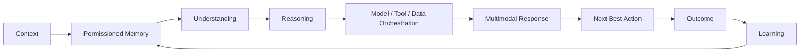

<div align="center">

# 🧠 LifeOS AI

### Human Intelligence & Care Operating System

**ASK LifeOS** — a personal AI operating layer designed to understand context, organize life, support health & care, and turn intent into meaningful action.

[](https://github.com/AddiX123/LifeOS-AI)
[](https://github.com/AddiX123/LifeOS-AI)
[](https://react.dev/)
[](https://vite.dev/)
[](https://www.typescriptlang.org/)

</div>

---

## 🌌 What is LifeOS AI?

LifeOS AI is being built as a **Human Intelligence & Care Operating System** — not just another chatbot.

> **Understand the person → reason about the situation → coordinate intelligence and tools → recommend the next best action → learn from outcomes.**

LifeOS brings conversation, goals, daily planning, research, personal knowledge, health & care, privacy, agents and AI-powered creation into one product experience.

### Product vision

**Context + Permissioned Memory + Goals + Constraints + Preferences + Conversational Context**

→ **Understanding** → **Reasoning** → **Model / Tool / Data Orchestration** → **Multimodal Response** → **Next Best Action** → **Outcome** → **Learning**

---

## 🧭 Explore LifeOS

| Module | Purpose |
|---|---|
| 🧠 **ASK LifeOS** | Natural-language AI workspace for questions, decisions, planning and action |
| 🎯 **Life Goals / Day Mastery** | Turn goals into plans and build consistent daily execution |
| ❤️ **Health & Care** | Health-focused intelligence and care workflows — the flagship vertical |
| 🔬 **Research** | Research-oriented knowledge and information workflows |
| 📚 **Library** | Personal files and knowledge workspace |
| 🤖 **Agents** | Specialized, permissioned task agents with review/approval gates |
| 🔐 **Privacy** | User-facing privacy and data-control experience |
| ⚙️ **Settings** | Product, account and experience configuration |
| 🎨 **AI Creation** | Image generation and creative workflows |
| 🎬 **Video** | Video generation workflows |
| 💳 **Billing** | Subscription and payment infrastructure |

---

## 🧬 LifeOS Intelligence Architecture



### The operating loop

1. **Context** — understand what is happening now.
2. **Memory** — use only information the user permits LifeOS to retain and use.
3. **Understanding** — interpret intent, constraints, preferences and conversation.
4. **Reasoning** — evaluate options, trade-offs and priorities.
5. **Orchestration** — select the appropriate model, tool, data or workflow.
6. **Response** — return the result in the most useful modality.
7. **Next Best Action** — move from information toward execution.
8. **Outcome** — observe what happened.
9. **Learning** — improve future assistance from permitted feedback and outcomes.

---

## ❤️ Health & Care — Flagship Vertical

LifeOS is designed to grow beyond general productivity into a **Health & Care operating layer**.

Long-term direction includes personal health context, care coordination, health-information understanding, medication and appointment organization, Care Circle workflows, preventive support, health research assistance, contextual next-best actions and privacy-first handling of sensitive information.

> **LifeOS is intended to assist people and care workflows — not replace qualified medical professionals or emergency services.**

---

## 🤖 Intelligence Layers

| Intelligence layer | Role |
|---|---|
| 🧠 Reasoning | Analyze situations, decisions and trade-offs |
| 🗂️ Memory | Maintain permissioned context |
| 🎯 Planning | Convert goals and intent into executable steps |
| 🔎 Research | Gather and organize relevant knowledge |
| 🛠️ Tool orchestration | Connect reasoning with external capabilities |
| 👁️ Multimodal | Support text, files, images and future voice workflows |
| ❤️ Care intelligence | Apply context-aware assistance to Health & Care |
| 🔁 Learning loop | Improve assistance through permitted outcomes and feedback |
| 🛡️ Safety | Keep human control, privacy and boundaries central |

---

## 📊 Framework Comparison

LifeOS is **framework-agnostic by design**. A framework should be selected for a specific workload rather than forcing the entire product into one abstraction.

| Framework / approach | Strong fit | LifeOS role | Key trade-off |
|---|---|---|---|
| **LangGraph** | Stateful, durable, graph-based agent workflows | ⭐ Complex orchestration candidate | More explicit architecture and operational complexity |
| **OpenAI Agents SDK** | Agents, tools, handoffs, guardrails and tracing | ⭐ Focused LifeOS agents | Greater ecosystem dependence |
| **CrewAI** | Role-based multi-agent teams | 🧪 Research/prototyping | Higher-level abstraction |
| **Microsoft Agent Framework** | Microsoft/Azure-oriented systems | 🔭 Enterprise research | Ecosystem-specific fit |
| **Google ADK** | Google/Gemini agent applications | 🔭 Gemini research | GCP/Gemini alignment |
| **LlamaIndex** | Documents, RAG and knowledge workflows | ⭐ Library/Research candidate | More data-focused than full OS orchestration |
| **Direct model/tool loop** | Small controlled workflows | ✅ Preferred when sufficient | More engineering responsibility |

> **LifeOS rule:** use the smallest abstraction that provides the reliability, state, observability, security and human-control guarantees required by the task.

---

## 🔧 Browse by Framework

### LangGraph
Stateful workflows, durable execution, checkpoints, complex routing and human-in-the-loop systems.

Potential LifeOS projects: Memory orchestration, Goal → Plan → Action, Deep Research, Care coordination and approval-gated pipelines.

### OpenAI Agents SDK
Focused agents, tools, handoffs, guardrails and tracing.

Potential LifeOS projects: ASK LifeOS specialists, Research Agent, Planning Agent, Library Agent and Safety/Policy Agent.

### CrewAI
Role-based agent teams and rapid multi-agent experiments.

Potential LifeOS projects: Researcher + Writer + Reviewer, marketing teams, career planning and business analysis.

### Microsoft Agent Framework
Enterprise and Microsoft ecosystem workflows.

Potential LifeOS projects: Care Circle workflows, Microsoft 365 productivity and organization knowledge agents.

### Google ADK
Google/Gemini-oriented agent applications.

Potential LifeOS projects: Gemini multimodal workflows, research agents and Workspace integrations.

### LlamaIndex
Documents, retrieval, indexing and knowledge-intensive applications.

Potential LifeOS projects: Personal Library RAG, Research knowledge base, health-document understanding and personal knowledge graph experiments.

> These framework pages are an architectural catalog, not a claim that every framework is currently installed. Integrations should earn their place through benchmarks and real product requirements.

---

## 🏭 Industry Use Cases

| Industry | Example LifeOS capability | Priority |
|---|---|---|
| ❤️ Healthcare & Care | Health context, care coordination, information organization | ⭐ Flagship |
| 🎓 Education | Study planning, research and learning workflows | High |
| 💼 Career | Career planning, applications and interview preparation | High |
| 🏢 Business | Meetings, research, planning and automation | High |
| 🔬 Research | Deep research, evidence synthesis and knowledge management | High |
| 💰 Finance | Personal organization and financial research | Medium |
| 👨‍👩‍👧 Family | Care Circle, shared goals and household planning | High |
| ✈️ Travel | Trip planning, documents and schedules | Medium |
| 🧑‍💻 Software | Coding research, project planning and agents | High |
| 🎨 Creative | Image, video, writing and content workflows | High |
| 📣 Marketing | Campaign planning, content and analytics | Medium |
| 🛍️ E-commerce | Product research and operations | Medium |
| 🏠 Personal Life | Routines, goals, decisions and daily planning | ⭐ Core |

### Use-case architecture

**Context → Memory → Understanding → Reasoning → Tools → Action → Outcome**

---

## 🧩 Capability Map

| Capability | LifeOS AI direction |
|---|---|
| Personal AI | ✅ Core |
| Conversational interface | ✅ Core |
| Goal management | ✅ Core |
| Daily planning | ✅ Core |
| Permissioned memory | 🚧 Expanding |
| Research workflows | ✅ Core |
| Personal library | ✅ Core |
| Health & Care | ❤️ Flagship |
| Multimodal interaction | 🚧 Expanding |
| Image generation | ✅ Integrated workflow |
| Video generation | ✅ Integrated workflow |
| Payments / subscriptions | ✅ Integrated workflow |
| Agentic orchestration | 🚧 Roadmap |
| Continuous learning | 🚧 Roadmap |

---

## 🤝 Contributing

Contributions are welcome! 🎉 LifeOS should grow through ideas, research, documentation, integrations and carefully reviewed code.

### Ways to contribute

1. **Build a LifeOS capability** — add a focused module, agent, tool adapter or UI improvement.
2. **Add an integration** — propose a framework, model, data source or external tool with a clear use case.
3. **Add an industry use case** — document a realistic workflow and its safety/permission requirements.
4. **Improve research** — add primary sources, benchmarks, experiments or architecture findings.
5. **Fix a bug or broken link** — open an issue or submit a focused pull request.
6. **Improve documentation** — clarify architecture, examples or limitations.
7. **Improve accessibility** — keyboard navigation, screen-reader support, contrast and multimodal usability.

### Contribution flow

```text
Fork → Branch → Focused change → Tests → Documentation → Pull Request → Review → Merge
```

Recommended branches: `feat/memory-engine`, `feat/research-agent`, `feat/health-care`, `feat/framework-adapter`, `fix/description`, `docs/research-topic`.

### Contribution principles

- Keep changes focused and reviewable.
- Never commit API keys, tokens or private health information.
- Consequential agent actions require explicit authorization and approval controls.
- Clearly label prototypes, experiments and production-ready features.
- Add evidence and citations for research or health-related claims.
- Prefer measurable improvements over feature count.

---

## ⭐ Star History

Follow the **live GitHub star history** for LifeOS AI:

[](https://star-history.com/#AddiX123/LifeOS-AI&Date)

### 🎯 10K milestone example

**Target example: 10,000 GitHub stars — 29 August 2026.**

The chart above reflects the repository's historical stars through Star History. The **10K / 29-Aug figure is a milestone target**, not a claim that LifeOS currently has 10,000 verified stars.

[](https://github.com/AddiX123/LifeOS-AI/blob/main/images/star-history.svg)

---

## 📜 License

This project is licensed under the **MIT License**. See [`LICENSE`](LICENSE) for details.

---

## 🔐 Security Principles

- 🔑 Never commit API keys or credentials.
- 🧠 Memory should be permissioned and user-controlled.
- 🔒 Sensitive Health & Care information requires stronger privacy boundaries.
- 👤 Human control remains central to consequential decisions.
- 🧯 AI output should be treated as assistance, not automatic authority.

See [`SECURITY.md`](SECURITY.md) for repository security guidance.

---

## 🗺️ Roadmap

### V1 — Foundation

- [x] ASK LifeOS
- [x] Life Goals / Day Mastery
- [x] Research
- [x] Library
- [x] Privacy
- [x] Settings
- [x] AI creation workflows
- [x] Billing foundation
- [x] GitHub project documentation
- [x] Framework comparison
- [x] Framework browsing architecture
- [x] Industry use-case catalog
- [x] Contribution guide
- [x] Star History

### V2 — Personal Intelligence

- [ ] Permissioned Memory Engine
- [ ] Context Assembler
- [ ] Personal Knowledge Graph
- [ ] Next-Best-Action Engine
- [ ] Deeper personalization
- [ ] Better goal-to-action planning

### V2.x — LifeOS Intelligence

- [ ] Agent Registry
- [ ] Agent permissions and approval gates
- [ ] Agent evaluation harness
- [ ] Advanced research workflows
- [ ] Outcome-based learning loops
- [ ] Expanded Health & Care capabilities

### Future

- [ ] Care Circle ecosystem
- [ ] Cross-platform LifeOS experience
- [ ] Advanced health integrations
- [ ] Developer / tool SDK
- [ ] Broader industry operating layers

---

## 🧠 The LifeOS Principle

LifeOS should not simply answer:

> **“What did you ask?”**

It should progressively understand:

> **“What are you trying to accomplish, what matters to you, what constraints exist, what happened before, and what is the best next step?”**

That is the foundation of the **Human Intelligence & Care Operating System**.

---

<div align="center">

### 🧠 LifeOS AI
**Understand. Reason. Act. Learn.**

⭐ [Star the repository](https://github.com/AddiX123/LifeOS-AI) if you want to follow the evolution of LifeOS AI.

</div>
